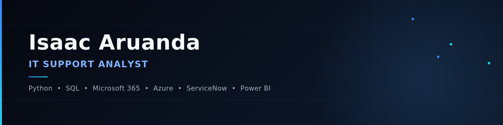

  

# Hi, I'm Isaac Aruanda 👋

### IT Support Analyst | Python | SQL | Microsoft 365 | Azure

 

## About Me

I'm an IT Support Analyst with experience supporting enterprise environments, Microsoft 365, Active Directory, ServiceNow and SQL.

I enjoy solving complex technical problems, automating repetitive tasks with Python, and building solutions that improve operational efficiency.

Currently pursuing a Bachelor's Degree in Systems Analysis and Development while preparing for international opportunities in Canada.

 

## Professional Highlights

<table width="100%">
<tr>
<td width="50%" valign="top">

**Experience**

✔ 3+ years in IT Support
✔ Enterprise Environment
✔ SLA Management
✔ Microsoft 365 Administration

</td>
<td width="50%" valign="top">

**Core Competencies**

✔ Active Directory
✔ SQL Troubleshooting
✔ Python Automation
✔ Incident & Problem Management

</td>
</tr>
</table>

 

## Certifications

 

## Technology Stack

<table width="100%">
<tr>
<td valign="top" width="20%">

**Cloud**

</td>
<td valign="top" width="20%">

**Infrastructure**

</td>
<td valign="top" width="20%">

**Automation**

</td>
<td valign="top" width="20%">

**Data**

</td>
<td valign="top" width="20%">

**Development**

</td>
</tr>
</table>

 

## Featured Projects

<table width="100%">
<tr>
<td width="50%" valign="top">

### Corporate Ticket System
Enterprise ticket management platform built with TypeScript.

</td>
<td width="50%" valign="top">

### IT Process Automation
Python automation scripts for repetitive IT operations.

</td>
</tr>
<tr>
<td width="50%" valign="top">

### Printer Maintenance Agent
Automation system used for thermal printer maintenance.

</td>
<td width="50%" valign="top">

### Business Intelligence Dashboard
Power BI dashboards with SQL integration.

</td>
</tr>
<tr>
<td width="50%" valign="top">

### SQL Database Project
Database modeling and data analysis.

</td>
<td width="50%" valign="top">

### IT Asset Management
Application for inventory and lifecycle management of IT assets.

</td>
</tr>
</table>

 

## GitHub Stats

 

 

 

## Currently Looking For

- IT Support Analyst
- Systems Analyst
- Technical Support
- Cloud Support
- Infrastructure Support
- **Canada Opportunities**

 

## Contact

 

---

Always learning. Always improving. Always building.

